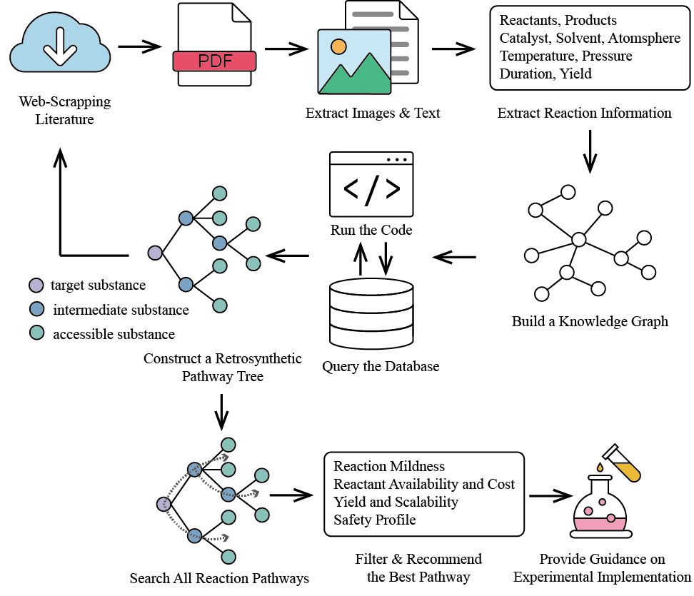

## RetroSynthesisAgent
code for "xxx" paper in xxx
### Workflow

### Requirements
+ rdkit
+ requests
+ python-dotenv
+ PyMuPDF
+ scholarly
+ openai
+ networkx
+ graphviz
+ pubchempy
+ Pillow
### Data
eMolecules download URL: https://downloads.emolecules.com/free/2024-07-01/
### Environment Setting
Set your OpenAI API key (`API_KEY`) and optional `BASE_URL` to use the LLM.
Set the `HEADERS` and `COOKIES` from your browser for web scraping of literature.
